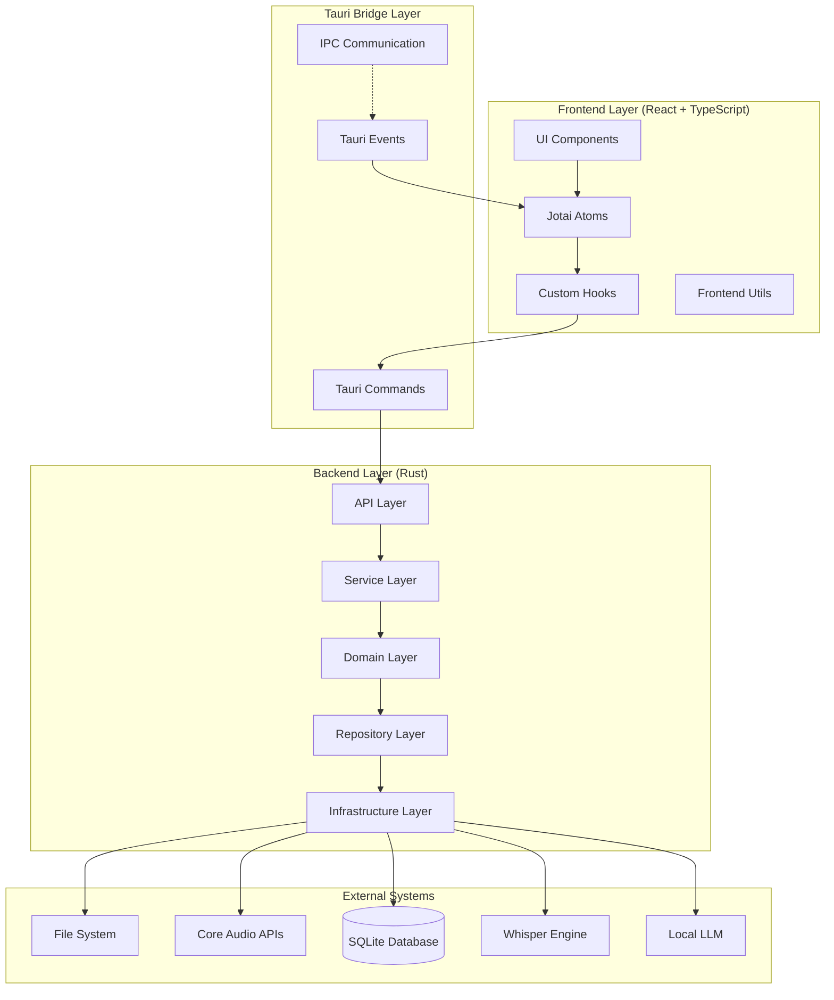
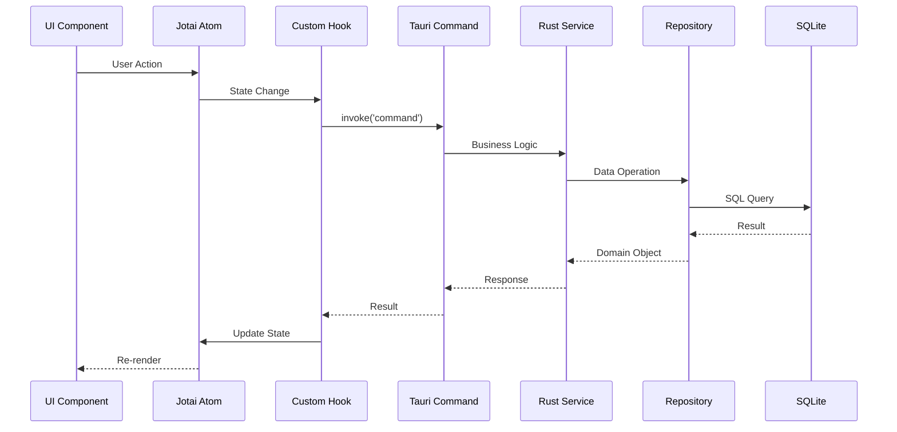

# Meeting Summarizer - Design Specification

## Overview

Meeting Summarizerは、**Clean Architecture**原則に基づき、**Tauri + React + TypeScript**で構築されるmacOSデスクトップアプリケーションです。完全ローカル処理により高いプライバシー保護を実現し、拡張性とパフォーマンスを両立します。

## Architecture Overview



## Frontend Architecture

### Component Structure

```
src/
├── components/
│   ├── ui/                    # Base UI components (Radix + Tailwind)
│   │   ├── Button.tsx
│   │   ├── Input.tsx
│   │   ├── Modal.tsx
│   │   └── index.ts
│   ├── features/
│   │   ├── recording/         # Recording feature components
│   │   │   ├── RecordingButton.tsx
│   │   │   ├── AudioVisualizer.tsx
│   │   │   └── RecordingControls.tsx
│   │   ├── transcription/     # Transcription feature components
│   │   │   ├── TranscriptionView.tsx
│   │   │   ├── TranscriptionEditor.tsx
│   │   │   └── LanguageSelector.tsx
│   │   └── summary/           # Summary feature components
│   │       ├── SummaryView.tsx
│   │       ├── SummaryEditor.tsx
│   │       └── ModelSelector.tsx
│   └── layout/                # Layout components
│       ├── AppLayout.tsx
│       ├── Sidebar.tsx
│       └── Header.tsx
├── hooks/                     # Custom React hooks
│   ├── useRecording.ts
│   ├── useTranscription.ts
│   ├── useSummary.ts
│   └── useTauri.ts
├── atoms/                     # Jotai atoms
│   ├── recording.ts
│   ├── transcription.ts
│   ├── summary.ts
│   ├── ui.ts
│   └── index.ts
├── types/                     # TypeScript type definitions
│   ├── recording.ts
│   ├── transcription.ts
│   ├── summary.ts
│   └── index.ts
├── utils/                     # Frontend utilities
│   ├── formatters.ts
│   ├── validators.ts
│   └── constants.ts
├── App.tsx
└── main.tsx
```

### Jotai State Management

```typescript
// atoms/recording.ts
import { atom } from 'jotai';
import { Recording } from '../types';

// Base atoms
export const isRecordingAtom = atom(false);
export const recordingDurationAtom = atom(0);
export const audioLevelAtom = atom(0);
export const currentRecordingAtom = atom<Recording | null>(null);
export const recordingsAtom = atom<Recording[]>([]);

// Derived atoms
export const recordingStatusAtom = atom((get) => ({
  isRecording: get(isRecordingAtom),
  duration: get(recordingDurationAtom),
  level: get(audioLevelAtom),
  recording: get(currentRecordingAtom)
}));

export const recordingStatsAtom = atom((get) => {
  const recordings = get(recordingsAtom);
  return {
    total: recordings.length,
    totalDuration: recordings.reduce((acc, r) => acc + r.duration, 0),
    averageDuration: recordings.length > 0 
      ? recordings.reduce((acc, r) => acc + r.duration, 0) / recordings.length 
      : 0
  };
});

// atoms/transcription.ts
export const transcriptionsAtom = atom<Transcription[]>([]);
export const currentTranscriptionAtom = atom<Transcription | null>(null);
export const transcriptionProgressAtom = atom(0);

// atoms/summary.ts
export const summariesAtom = atom<Summary[]>([]);
export const currentSummaryAtom = atom<Summary | null>(null);
export const selectedModelAtom = atom<string>('default');

// atoms/ui.ts
export const themeAtom = atom<'light' | 'dark'>('light');
export const currentViewAtom = atom<'recording' | 'transcription' | 'summary'>('recording');
export const sidebarOpenAtom = atom(true);
```

### Custom Hooks

```typescript
// hooks/useRecording.ts
import { useAtom } from 'jotai';
import { invoke } from '@tauri-apps/api/tauri';
import { 
  isRecordingAtom, 
  recordingDurationAtom, 
  currentRecordingAtom 
} from '../atoms/recording';

export const useRecording = () => {
  const [isRecording, setIsRecording] = useAtom(isRecordingAtom);
  const [duration, setDuration] = useAtom(recordingDurationAtom);
  const [currentRecording, setCurrentRecording] = useAtom(currentRecordingAtom);

  const startRecording = async () => {
    try {
      const recordingId = await invoke<string>('start_recording');
      setIsRecording(true);
      setCurrentRecording({ id: recordingId, status: 'recording' });
    } catch (error) {
      console.error('Failed to start recording:', error);
    }
  };

  const stopRecording = async () => {
    try {
      const recording = await invoke<Recording>('stop_recording');
      setIsRecording(false);
      setCurrentRecording(recording);
      setDuration(0);
    } catch (error) {
      console.error('Failed to stop recording:', error);
    }
  };

  return {
    isRecording,
    duration,
    currentRecording,
    startRecording,
    stopRecording
  };
};
```

## Backend Architecture (Rust)

### Project Structure

```
src-tauri/
├── src/
│   ├── commands/              # Tauri command handlers
│   │   ├── recording.rs
│   │   ├── transcription.rs
│   │   ├── summary.rs
│   │   └── mod.rs
│   ├── services/              # Business logic layer
│   │   ├── recording_service.rs
│   │   ├── transcription_service.rs
│   │   ├── summary_service.rs
│   │   └── mod.rs
│   ├── models/                # Domain models
│   │   ├── recording.rs
│   │   ├── transcription.rs
│   │   ├── summary.rs
│   │   └── mod.rs
│   ├── repositories/          # Data access layer
│   │   ├── recording_repository.rs
│   │   ├── transcription_repository.rs
│   │   ├── summary_repository.rs
│   │   └── mod.rs
│   ├── infrastructure/        # External integrations
│   │   ├── database.rs
│   │   ├── audio.rs
│   │   ├── whisper.rs
│   │   ├── llm.rs
│   │   └── mod.rs
│   ├── errors/               # Error handling
│   │   ├── app_error.rs
│   │   └── mod.rs
│   ├── config/               # Configuration
│   │   ├── settings.rs
│   │   └── mod.rs
│   ├── lib.rs
│   └── main.rs
├── Cargo.toml
├── tauri.conf.json
└── build.rs
```

### Tauri Commands

```rust
// commands/recording.rs
use tauri::State;
use crate::services::RecordingService;
use crate::models::Recording;
use crate::errors::AppError;

#[tauri::command]
pub async fn start_recording(
    service: State<'_, RecordingService>
) -> Result<String, String> {
    service.start_recording()
        .await
        .map_err(|e| e.to_string())
}

#[tauri::command]
pub async fn stop_recording(
    service: State<'_, RecordingService>
) -> Result<Recording, String> {
    service.stop_recording()
        .await
        .map_err(|e| e.to_string())
}

#[tauri::command]
pub async fn get_recordings(
    service: State<'_, RecordingService>
) -> Result<Vec<Recording>, String> {
    service.get_recordings()
        .await
        .map_err(|e| e.to_string())
}

#[tauri::command]
pub async fn delete_recording(
    id: String,
    service: State<'_, RecordingService>
) -> Result<(), String> {
    service.delete_recording(&id)
        .await
        .map_err(|e| e.to_string())
}
```

### Domain Models

```rust
// models/recording.rs
use serde::{Deserialize, Serialize};
use chrono::{DateTime, Utc};

#[derive(Debug, Clone, Serialize, Deserialize)]
pub struct Recording {
    pub id: String,
    pub user_id: Option<String>,
    pub title: String,
    pub description: Option<String>,
    pub file_path: String,
    pub file_size: i64,
    pub duration: Option<i32>,
    pub format: String,
    pub sample_rate: i32,
    pub channels: i32,
    pub status: RecordingStatus,
    pub privacy_level: PrivacyLevel,
    pub tags: Option<String>, // JSON
    pub metadata: Option<String>, // JSON
    pub created_at: DateTime<Utc>,
    pub updated_at: DateTime<Utc>,
}

#[derive(Debug, Clone, Serialize, Deserialize)]
pub enum RecordingStatus {
    Recording,
    Processing,
    Completed,
    Failed,
}

#[derive(Debug, Clone, Serialize, Deserialize)]
pub enum PrivacyLevel {
    Private,
    Confidential,
    Public,
}

// models/transcription.rs
#[derive(Debug, Clone, Serialize, Deserialize)]
pub struct Transcription {
    pub id: String,
    pub recording_id: String,
    pub content: String,
    pub language: String,
    pub confidence_score: Option<f64>,
    pub engine_used: Option<String>,
    pub engine_version: Option<String>,
    pub word_count: Option<i32>,
    pub processing_time: Option<i32>,
    pub segments: Option<String>, // JSON
    pub status: TranscriptionStatus,
    pub error_message: Option<String>,
    pub created_at: DateTime<Utc>,
    pub updated_at: DateTime<Utc>,
}

#[derive(Debug, Clone, Serialize, Deserialize)]
pub enum TranscriptionStatus {
    Processing,
    Completed,
    Failed,
}
```

## Database Design

### Enhanced SQLite Schema

```sql
-- Users table (future multi-user support)
CREATE TABLE users (
    id TEXT PRIMARY KEY,
    username TEXT UNIQUE NOT NULL,
    email TEXT UNIQUE,
    created_at DATETIME DEFAULT CURRENT_TIMESTAMP,
    updated_at DATETIME DEFAULT CURRENT_TIMESTAMP
);

-- Settings table
CREATE TABLE settings (
    id TEXT PRIMARY KEY,
    user_id TEXT,
    category TEXT NOT NULL,
    key TEXT NOT NULL,
    value TEXT,
    created_at DATETIME DEFAULT CURRENT_TIMESTAMP,
    updated_at DATETIME DEFAULT CURRENT_TIMESTAMP,
    FOREIGN KEY (user_id) REFERENCES users(id) ON DELETE CASCADE,
    UNIQUE(user_id, category, key)
);

-- Enhanced recordings table
CREATE TABLE recordings (
    id TEXT PRIMARY KEY,
    user_id TEXT,
    title TEXT NOT NULL,
    description TEXT,
    file_path TEXT NOT NULL UNIQUE,
    file_size INTEGER NOT NULL DEFAULT 0,
    duration INTEGER,
    format TEXT NOT NULL DEFAULT 'wav',
    sample_rate INTEGER DEFAULT 44100,
    channels INTEGER DEFAULT 2,
    status TEXT NOT NULL DEFAULT 'recording' CHECK (status IN ('recording', 'processing', 'completed', 'failed')),
    privacy_level TEXT DEFAULT 'private' CHECK (privacy_level IN ('private', 'confidential', 'public')),
    tags TEXT,
    metadata TEXT,
    created_at DATETIME DEFAULT CURRENT_TIMESTAMP,
    updated_at DATETIME DEFAULT CURRENT_TIMESTAMP,
    FOREIGN KEY (user_id) REFERENCES users(id) ON DELETE CASCADE
);

-- Enhanced transcriptions table
CREATE TABLE transcriptions (
    id TEXT PRIMARY KEY,
    recording_id TEXT NOT NULL,
    content TEXT NOT NULL,
    language TEXT NOT NULL DEFAULT 'ja',
    confidence_score REAL,
    engine_used TEXT,
    engine_version TEXT,
    word_count INTEGER,
    processing_time INTEGER,
    segments TEXT,
    status TEXT NOT NULL DEFAULT 'processing' CHECK (status IN ('processing', 'completed', 'failed')),
    error_message TEXT,
    created_at DATETIME DEFAULT CURRENT_TIMESTAMP,
    updated_at DATETIME DEFAULT CURRENT_TIMESTAMP,
    FOREIGN KEY (recording_id) REFERENCES recordings(id) ON DELETE CASCADE
);

-- Enhanced summaries table
CREATE TABLE summaries (
    id TEXT PRIMARY KEY,
    transcription_id TEXT NOT NULL,
    type TEXT NOT NULL DEFAULT 'brief' CHECK (type IN ('brief', 'detailed', 'action_items', 'key_points', 'custom')),
    content TEXT NOT NULL,
    model_used TEXT NOT NULL,
    model_version TEXT,
    prompt_template TEXT,
    word_count INTEGER,
    processing_time INTEGER,
    quality_score REAL,
    status TEXT NOT NULL DEFAULT 'processing' CHECK (status IN ('processing', 'completed', 'failed')),
    error_message TEXT,
    created_at DATETIME DEFAULT CURRENT_TIMESTAMP,
    updated_at DATETIME DEFAULT CURRENT_TIMESTAMP,
    FOREIGN KEY (transcription_id) REFERENCES transcriptions(id) ON DELETE CASCADE
);

-- Action items table
CREATE TABLE action_items (
    id TEXT PRIMARY KEY,
    summary_id TEXT NOT NULL,
    title TEXT NOT NULL,
    description TEXT,
    assignee TEXT,
    due_date DATE,
    priority TEXT DEFAULT 'medium' CHECK (priority IN ('low', 'medium', 'high', 'urgent')),
    status TEXT DEFAULT 'pending' CHECK (status IN ('pending', 'in_progress', 'completed', 'cancelled')),
    created_at DATETIME DEFAULT CURRENT_TIMESTAMP,
    updated_at DATETIME DEFAULT CURRENT_TIMESTAMP,
    FOREIGN KEY (summary_id) REFERENCES summaries(id) ON DELETE CASCADE
);

-- Model configurations table
CREATE TABLE model_configs (
    id TEXT PRIMARY KEY,
    name TEXT UNIQUE NOT NULL,
    provider TEXT NOT NULL,
    model_name TEXT NOT NULL,
    api_endpoint TEXT,
    max_tokens INTEGER,
    temperature REAL DEFAULT 0.7,
    system_prompt TEXT,
    is_active BOOLEAN DEFAULT 1,
    created_at DATETIME DEFAULT CURRENT_TIMESTAMP,
    updated_at DATETIME DEFAULT CURRENT_TIMESTAMP
);

-- Performance indexes
CREATE INDEX idx_recordings_user_created_at ON recordings(user_id, created_at DESC);
CREATE INDEX idx_recordings_status ON recordings(status);
CREATE INDEX idx_transcriptions_recording_id ON transcriptions(recording_id);
CREATE INDEX idx_summaries_transcription_id ON summaries(transcription_id);
CREATE INDEX idx_action_items_summary_id ON action_items(summary_id);
```

## TypeScript Type System

```typescript
// types/recording.ts
export interface Recording {
  readonly id: string;
  readonly userId?: string;
  readonly title: string;
  readonly description?: string;
  readonly filePath: string;
  readonly fileSize: number;
  readonly duration?: number;
  readonly format: AudioFormat;
  readonly sampleRate: number;
  readonly channels: number;
  readonly status: RecordingStatus;
  readonly privacyLevel: PrivacyLevel;
  readonly tags?: string[];
  readonly metadata?: Record<string, unknown>;
  readonly createdAt: Date;
  readonly updatedAt: Date;
}

export type AudioFormat = 'wav' | 'mp3' | 'aac';
export type RecordingStatus = 'recording' | 'processing' | 'completed' | 'failed';
export type PrivacyLevel = 'private' | 'confidential' | 'public';

// types/transcription.ts
export interface Transcription {
  readonly id: string;
  readonly recordingId: string;
  readonly content: string;
  readonly language: Language;
  readonly confidenceScore?: number;
  readonly engineUsed?: string;
  readonly engineVersion?: string;
  readonly wordCount?: number;
  readonly processingTime?: number;
  readonly segments?: TranscriptionSegment[];
  readonly status: TranscriptionStatus;
  readonly errorMessage?: string;
  readonly createdAt: Date;
  readonly updatedAt: Date;
}

export interface TranscriptionSegment {
  readonly id: string;
  readonly start: number;
  readonly end: number;
  readonly text: string;
  readonly confidence?: number;
}

export type Language = 'ja' | 'en' | 'zh' | 'ko';
export type TranscriptionStatus = 'processing' | 'completed' | 'failed';

// types/summary.ts
export interface Summary {
  readonly id: string;
  readonly transcriptionId: string;
  readonly type: SummaryType;
  readonly content: string;
  readonly modelUsed: string;
  readonly modelVersion?: string;
  readonly promptTemplate?: string;
  readonly wordCount?: number;
  readonly processingTime?: number;
  readonly qualityScore?: number;
  readonly status: SummaryStatus;
  readonly errorMessage?: string;
  readonly createdAt: Date;
  readonly updatedAt: Date;
}

export type SummaryType = 'brief' | 'detailed' | 'action_items' | 'key_points' | 'custom';
export type SummaryStatus = 'processing' | 'completed' | 'failed';
```

## Data Flow Architecture



## Security Architecture

### Data Protection
- **Local Processing**: すべての音声・テキスト処理はローカルで実行
- **Encryption**: SQLiteデータベースの暗号化オプション
- **Sandboxing**: Tauriのサンドボックス機能活用
- **Permissions**: 最小権限の原則に基づくシステムアクセス

### Privacy Features
- **Data Isolation**: ユーザーデータの完全分離
- **Privacy Levels**: 録音データのプライバシーレベル管理
- **Audit Trail**: アクセスログとセキュリティ監査

## Performance Considerations

### Frontend Optimization
- **Jotai**: 細粒度更新による効率的な状態管理
- **Lazy Loading**: 大きなコンポーネントの遅延読み込み
- **Memoization**: 重い計算の結果キャッシュ
- **Virtual Scrolling**: 大量データの効率的表示

### Backend Optimization
- **Async/Await**: 非同期処理による応答性確保
- **Connection Pooling**: データベース接続の効率化
- **Batch Processing**: 複数操作のバッチ実行
- **Caching**: 頻繁にアクセスされるデータのキャッシュ

## Technology Stack Summary

### Frontend
- **Framework**: React 18 + TypeScript
- **State Management**: Jotai
- **UI Components**: Radix UI + Tailwind CSS
- **Build Tool**: Vite
- **Testing**: Vitest + React Testing Library

### Backend
- **Framework**: Tauri
- **Language**: Rust
- **Database**: SQLite + Rusqlite
- **Audio Processing**: Core Audio APIs
- **AI Integration**: whisper.cpp + Ollama

### Development Tools
- **Package Manager**: npm/pnpm
- **Code Quality**: ESLint + Prettier
- **Type Checking**: TypeScript strict mode
- **Testing**: Vitest + Playwright
- **CI/CD**: GitHub Actions